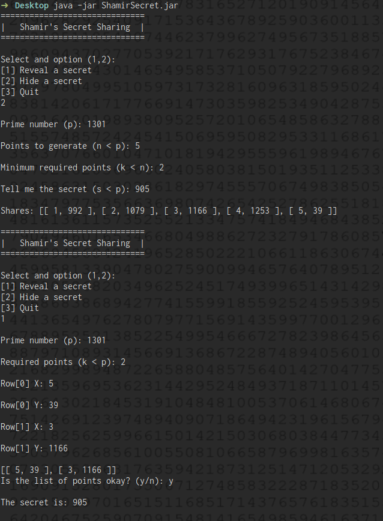

# Shamir Secret

Simple command line Java implementation of the technique exposed in the paper "How to Share a Secret" by Adi Shamir (MIT November 1979). 

## Definition

Reference: [Shamir's Secret Sharing](https://en.wikipedia.org/wiki/Shamir%27s_Secret_Sharing)

It is a form of secret sharing, where a secret is divided into parts, giving each participant its own unique part, where some of the parts or all of them are needed in order to reconstruct the secret.

The goal is to divide  (an integer number) into  pieces of   ,..., in shuch a way that:

- Knowledge of any  or more  pieces makes _D_ easily computable
- Knowledge of any  or fewer  pieces leaves  completely undetermined 

This scheme is called a ) threshold scheme.

## Usage

Run with:
```shell
$ java -jar ShamirSecret.jar
```

__Menu__

* 1 to reveal a secret usign [Lagrange polynomial](https://en.wikipedia.org/wiki/Lagrange_polynomial) interpolation
* 2 to hide a secret and generate the  points to share using the [Shamir's scheme](https://en.wikipedia.org/wiki/Shamir%27s_Secret_Sharing#Usage)
* 3 to quit

__Prime number__

[There](https://en.wikipedia.org/wiki/Shamir%27s_Secret_Sharing#Problem) is a security problem using integer arithmetic. A possible attacker gains a lot of information about  with every  that he finds. To fix that, finite field arithmetic can be [used](https://en.wikipedia.org/wiki/Shamir%27s_Secret_Sharing#Solution). It just means that we should choose a prime  that is bigger than the total of participants  and the secret . Thus we have to calculate the points as  instead of .


## Capture


